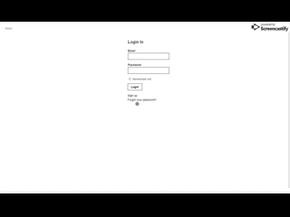
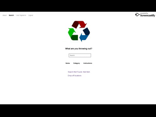
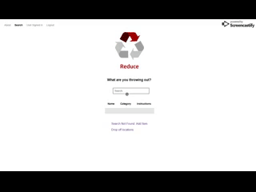
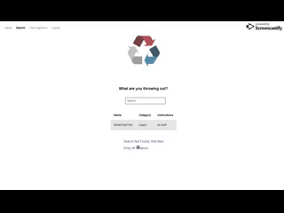
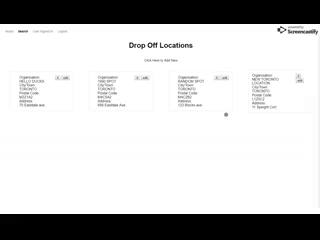

# Waste-Relations

This app will help you to find out where to properly dispose of garbage, recycling, organics and other items in your building.

Find donation centers for items that are still in good condition.

## Available npm scripts

- npm start - starts express server
- npm test - checks linting and mocha
- npm seed - migrations and seeding via Sequelize CLI.

## Demo

### Start up

### Login

### Search

### Add New Item

### Add New Location

### Edit Location

### Responsive Web Design

## Preview

<a href="https://wasterelations.herokuapp.com/" target="_blank">Live Preview</a>
